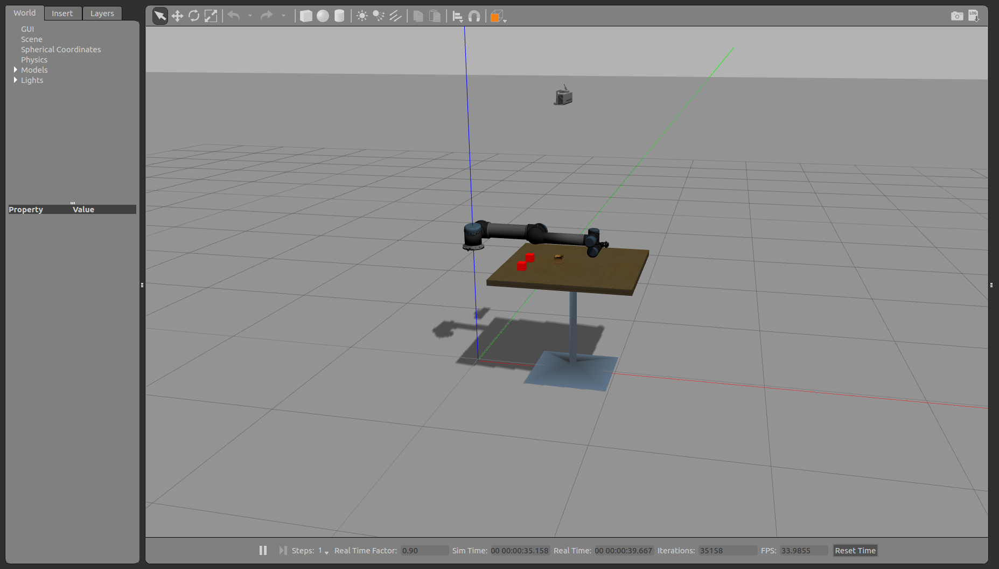
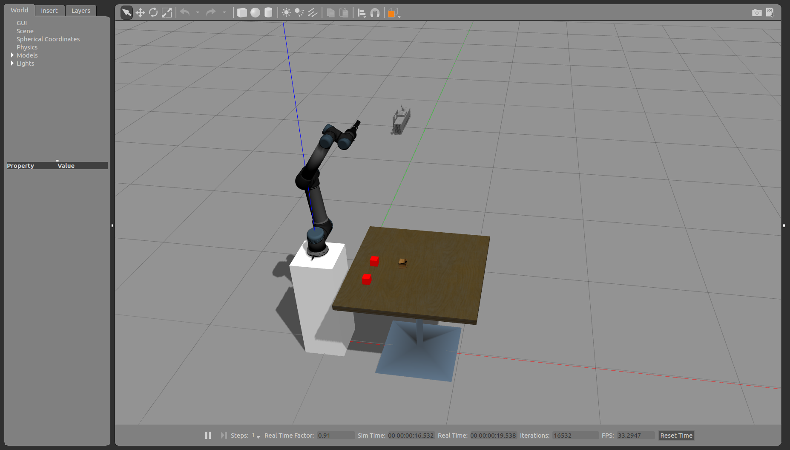
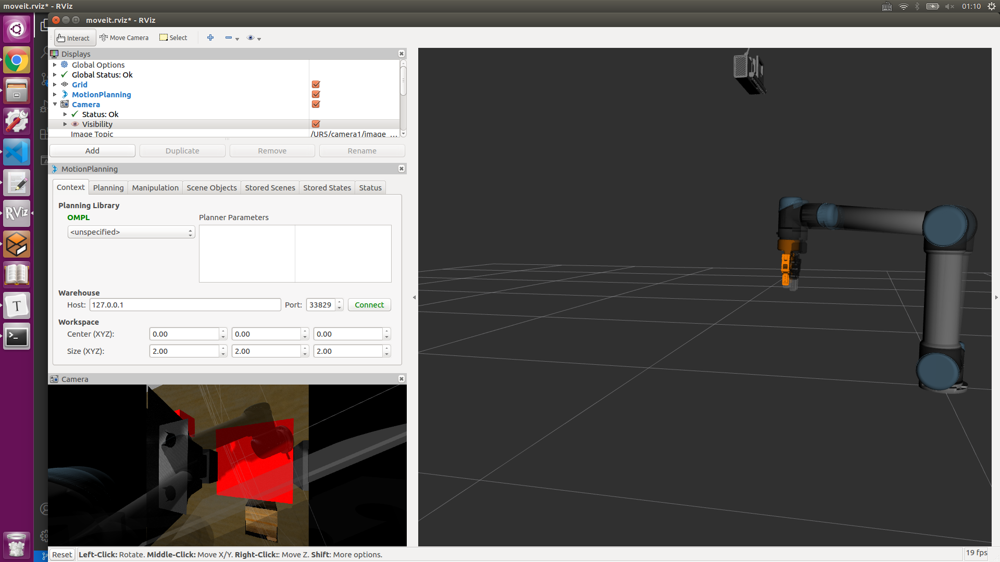
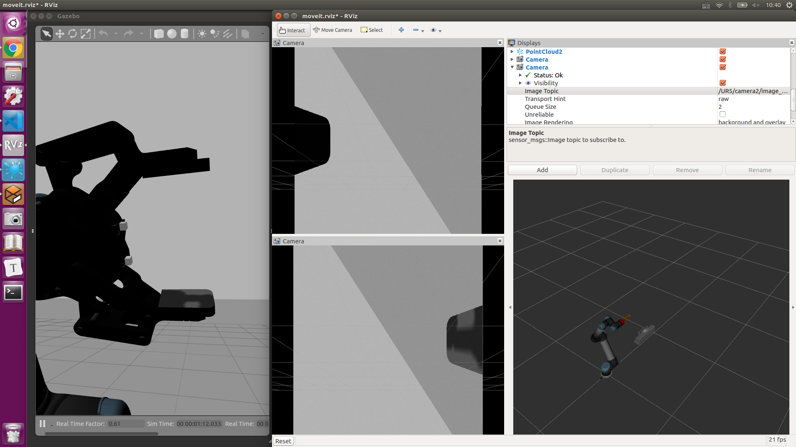
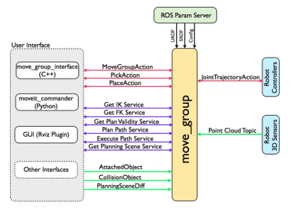
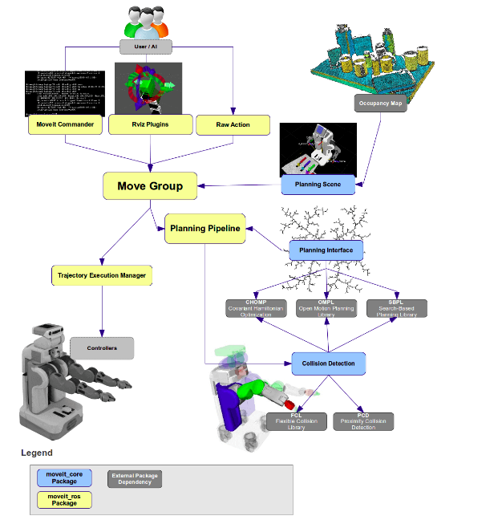
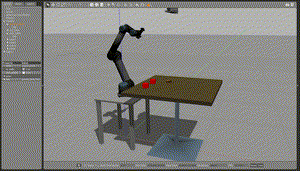

# Grasping based on UR5

  This project is based on the Robot Operate System and Simulate on it. The Robot Arm we used is universal robot 5 and the simulate world is build by Gazebo. Follow I will introduce and record how to complete this project and share some figure which is the captured in the build process.

------

## **For Running this project mainly used follow command**

```bash
$ roslaunch roslaunch ur5_single_arm_tufts ur5_single_arm_gazebo.launch
$ rosrun rosrun ur5_manipulation UR_test1
```

在此基础上可以进行二次开发，欢迎咨询

------

## Part 1: Build the Gazebo Word && Simulate UR5 in it.

  We can create UR5 from the document in official website and what we need to build is the world to simulate in. Because of Gazebo which have excellent API for ROS and have a great performance in simulate, we need to create a grasping environment for this project. At first, we need to download the model from the github website and the guide for it can be found in the Google search. After download the model for gazebo, we start to create simulation world for it and save the world file named by the end of `.world`. Then, we add the model of UR5 in the world by launch file. The launch file can be written as :

```xml
<launch>
  <arg name="paused" default="true"/>
  <arg name="gui" default="true"/>
  <arg name="sim" default="true" />
  <arg name="debug" default="false"/>
  <!-- startup simulated world -->
  <include file="$(find gazebo_ros)/launch/empty_world.launch">
    <!--arg name="world_name" default="worlds/empty.world"/-->
    <arg name="world_name" default="$(find ur5_single_arm_tufts)/worlds/ur5_cubes.world"/>
    <arg name="paused" value="$(arg paused)"/>
    <arg name="gui" value="$(arg gui)"/>
  </include>
  <!-- send robot urdf to param server -->
  <param name="robot_description" command="$(find xacro)/xacro --inorder '$(find ur5_single_arm_tufts)/urdf/ur5_single_arm.urdf.xacro'"/>
  <!-- push robot_description to factory and spawn robot in gazebo -->
  <node name="spawn_gazebo_model" pkg="gazebo_ros" type="spawn_model"
        args="-urdf -param robot_description -model robot -z 0.90
              -J shoulder_lift_joint -2.0
              -J elbow_joint 1.0"
        output="screen" />

</launch>
```

  The first part of it is the argument which will be used bellow and the second part is about the launch file run the gazebo in the ROS. In this launch file, we need to define which world to simulate mainly in the gazebo and other arguments. The next part is about the UR5 robot description and using the xacro to explain the file for it and using the spawn to push it to factory and spawn robot in the gazebo.  The running result show in the bellow figure.

|       Figure 1.1: The Gazebo World 1 (error)       |      Figure 1.2: The Gazebo World 2 (accurate)      |
| :------------------------------------------------: | :-------------------------------------------------: |
|  |  |

------

## Part 2: Provide Vision and Gripper for the End Effector

  For the grasping work, the end effector need the Gripper at fist and the problem is how to get the object position which can be coped by camera. The gripper in this project is used open source project named robotq_85_gripper. And the camera is used kinetic depth camera and the provision by Gazebo plugin. The gazebo provides ROS interface for simulating cameras such as wge100_camera by publishing the Camera Info and image ROS messages as described in sensor messages.

  At this part, we will review a simple RGB camera attached to the end of the UR5 pendulum arm.  The first elements of this block are an extra link and joint added to the URDF file that represents the camera. We are just using a simple red box to represent the camera, though typically you could see a mesh file for a better representation.   

```xml
<xacro:property name="camera_link" value="0.005" />
<xacro:property name="height3" value="0.0" />
<xacro:property name="axel_offset" value="0.0" />

<joint name="camera_joint" type="fixed">
	<axis xyz="0 1 0" />
    <origin xyz="${camera_link*2} 0 ${height3 - axel_offset*2}" rpy="0 0 0"/>
    <parent link="gripper_finger1_inner_knuckle_link"/>
    <child link="camera_link"/>
</joint>
<link name="camera_link">
	<collision>
    	<origin xyz="0 0 0" rpy="0 0 0"/>
      	<geometry>
    <box size="${camera_link} ${camera_link} ${camera_link}"/>
      	</geometry>
    </collision>
    <visual>
      <origin xyz="0 0 0" rpy="0 0 0"/>
      <geometry>
    <box size="${camera_link} ${camera_link} ${camera_link}"/>
      </geometry>
    </visual>
</link>
```

  From the program, we can know that the camera joint was fixed by the parent joint named `gripper_finger1_inner_knuckle_link` which is the end effector of UR5. And we should be able to launch the UR5 and see a red box attached to the end of the arm. Next we will review the Gazebo plugin that gives us the camera functionality and publishes the image to a ROS message. In the UR5 we have been following the convertion of putting Gazebo elements in the `common.gazebo.xacro` file.

  After all above of it, the image from the camera can be subscribed in Rviz. The image show the occasion that the manipulator grasp the red box. The left image show that the surrounding captured by monocular camera and based on the first camera we can add the other camera which can achieve binocular camera with the first. The right image show that the binocular camera that the top one is the left one and other is the right one.

| Fig 2.1: The Monocular Camera in the End Effector | Fig 2.2: The Binocular Camera with two exclusive Camera |
| :-----------------------------------------------: | :-----------------------------------------------------: |
|  |      |

------

## Part 3: Gazebo ROS Control

  This section will introduce ROS Control which is consist of the one for  controlling the UR5 and the other for controlling gripper. In the above launch file, we already add this two control package in it and both of them can be found in the UR5 official document and gripper project document.

  The file path of controller package for UR5 is `/ur_gazebo/launch/controller_utils.launch`  and the other for gripper is `robotiq_85_gazebo/launch/controller_utils.launch`. There are also some configuration file which need to define the control coefficient. So this part of launch file is written as follows:

```xml
<include file="$(find ur_gazebo)/launch/controller_utils.launch"/>
<include file="$(find robotiq_85_gazebo)/launch/controller_utils.launch">

<rosparam file="$(find ur_gazebo)/controller/arm_controller_ur5.yaml" command="load"/>
<rosparam file="$(find robotiq_85_gazebo)/controller/gripper_controller_robotiq.yaml" command="load"/>
<node name="arm_controller_spawner" pkg="controller_manager" type="controller_manager" args="spawn arm_controller gripper" respawn="false" output="screen"/>

```

------

## Part 4: Moveit!  Setup Assistant

  It has been shown in the [Moveit! official website][https://ros-planning.github.io/moveit_tutorials/doc/setup_assistant/setup_assistant_tutorial.html] and the Moveit Setup Assistant is a graphical user interface for configuring any robot for use with Moveit. Its primary function is generating a Semantic Robot Description Format(SRDF) file for your robot. Additionally, it generates other necessary configuration files for use with the Moveit pipeline. To learn more about the SRDF, you can go through the URDF/SRDF Overview page. And you need to prepare the Moveit appropriate your own ROS version.

------

## Part 5: Move-Group Control

  This node serves as an integrator: pulling all the individual components together to provide a set of ROS actions and services for users to use.

| Fig 5.1: The Move-Group Node |          Fig 5.2: Quick High Level Diagram           |
| :--------------------------: | :--------------------------------------------------: |
|      |  |

  The figure above shows the move-group node and the high-level system architecture for the primary node provided by Moveit called move-group. For using the Move-Group Control node, we can create a package by this command:

```bash
$ catkin_create_pkg ur5_manipulation control_msgs controller_manager geometry_msgs hardware_interface industrial_msgs roscpp sensor_msgs std_srvs tf trajectory_msgs ur_msgs rospy moveit_msgs moveit_ros_perception moveit_ros_planning_interface
```

  And create file path src in this package and touch a file with c++ program language. In this file we programming as this :

```cpp

#include<moveit/move_group_interface/move_group_interface.h>
#include <moveit/planning_scene_interface/planning_scene_interface.h>
#include <moveit_msgs/DisplayRobotState.h>
#include <moveit_msgs/DisplayTrajectory.h>
#include <moveit_msgs/AttachedCollisionObject.h>
#include <moveit_msgs/CollisionObject.h>
#include <vector>
 
int main(int argc, char **argv)
{
    ros::init(argc, argv, "UR5_test1");
    ros::AsyncSpinner spinner(1);
    spinner.start();

    moveit::planning_interface::MoveGroupInterface arm("manipulator");
    moveit::planning_interface::MoveGroupInterface gripper("gripper");
    arm.setGoalJointTolerance(0.001);
    arm.setMaxAccelerationScalingFactor(0.2);
    arm.setMaxVelocityScalingFactor(0.2);
 
    arm.setNamedTarget("home_j");
    arm.move();
    sleep(1);
 
    gripper.setNamedTarget("open");
    gripper.move();
    sleep(1);
 
    ros::shutdown();
    return 0;
}
```

  And based on the running launch file, we can run this c++ file in other terminal and it will get move the robot successfully.

| GIF 1: Gazebo Simulation  |  GIF 2: Rviz Simulation   |
| :-----------------------: | :-----------------------: |
|  |  |

  I guess the reason why the blurry occur in the Rviz is that the depth data achieved by kinetic camera is the parallel plane and has a delay effect. The gripper has occluded the red box which is found in the past Rviz and there is only some part of red box which can be captured by kinetic camera. 

  Next time, I will try to use the multiple kinetic cameras and classify the objects captured by cameras. What's more, it's is a worthier project to use a robot arm to auto classify the object into the same assemble.

Thanks for the project provided by Lesson [Mobile Robot Control Experiment]

The according website:

[CSDN: Grasping based on UR5][https://blog.csdn.net/weixin_42139267/article/details/110953023]

